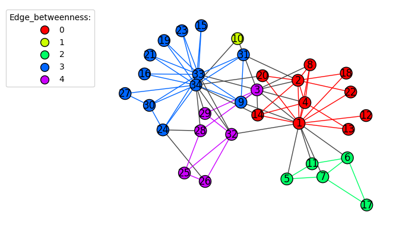
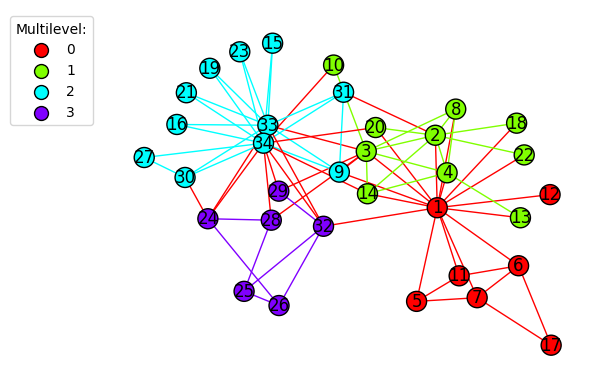
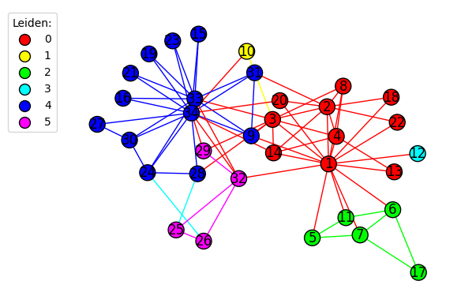

## **Grupos Reais (Ground Truth)**  

A separação real dos membros do clube após o conflito entre dois mestres:

### Grupo 1 (facção do nó 34)  

`34, 33, 23, 10, 31, 29, 32, 25, 26, 28, 24, 19, 21, 30, 16, 27, 15`

### Grupo 2 (facção do nó 1)  

`1, 9, 14, 20, 4, 13, 11, 6, 12, 17, 7, 5, 22, 18, 2, 8, 3`

## **Resultado – Edge Betweenness**

### Grupos Detectados

- **Grupo 1**: `1, 4, 2, 20, 14, 8, 18, 22, 12, 13`  
  Parte consistente da facção do nó 1.
- **Grupo 2**: `10`  
  Isolado, sem justificativa clara a partir da estrutura real.
- **Grupo 3**: `7, 5, 11, 6, 17`  
  Subgrupo interno coerente com a facção do nó 1.
- **Grupo 4**: `34, 33, 9, 31, 15, 23, 19, 21, 16, 27, 30, 24`  
  Parte central da facção do nó 34.
- **Grupo 5**: `32, 29, 3, 28, 25, 26`  
  Mistura de membros da facção do nó 34 com um elemento da facção oposta (nó 3), o que indica imprecisão.

**Análise:**  
Embora identifique subestruturas relevantes, o algoritmo apresenta segmentação excessiva e inconsistências, como a presença de nós isolados e agrupamentos que contradizem a divisão real.

## **Resultado – Multilevel (Louvain)**

### Grupos Detectados

- **Grupo 1**: `1, 12, 11, 5, 7, 6, 17`  
  Subgrupo bem definido da facção do nó 1.
- **Grupo 2**: `4, 2, 14, 3, 20, 10, 8, 18, 22, 13`  
  Representa o restante da facção do nó 1, com coesão.
- **Grupo 3**: `34, 33, 9, 31, 15, 23, 19, 21, 16, 27, 30`  
  Parte significativa da facção do nó 34.
- **Grupo 4**: `28, 29, 32, 24, 25, 26`  
  Complementa a facção do nó 34, com uma separação aceitável.

**Análise:**  
O algoritmo produz uma segmentação clara e alinhada com os grupos reais. Apesar de dividir a facção do nó 34 em dois grupos, mantém coesão interna e consistência com a estrutura da rede.

## **Resultado – Leiden (com resolution_parameter = 0.1)**

### Grupos Detectados

- **Grupo 1**: `1, 4, 2, 3, 14, 20, 8, 18, 22, 13`  
  Núcleo bem formado da facção do nó 1.
- **Grupo 2**: `10`  
  Isolado, o que pode indicar fragmentação desnecessária.
- **Grupo 3**: `7, 5, 11, 6, 17`  
  Subgrupo coeso da facção do nó 1.
- **Grupo 4**: `12`  
  Isolado, apesar de estar fortemente associado ao grupo 1.
- **Grupo 5**: `34, 33, 9, 31, 15, 23, 19, 21, 16, 27, 30, 24, 28`  
  Representa o núcleo da facção do nó 34 de forma precisa.
- **Grupo 6**: `29, 32, 25, 26`  
  Complementa a facção do nó 34.

**Análise:**  
O Leiden com ajuste no parâmetro de resolução produz uma segmentação altamente coerente com os grupos reais. A divisão em subgrupos reflete nuances da estrutura, e a maioria dos agrupamentos é fiel à separação original. Os poucos nós isolados (como `10` e `12`) indicam pequenos excessos de granularidade.

## **Resumo Comparativo**

| Algoritmo             | Aderência à Separação Real       | Observações |
|----------------------|----------------------------------|-------------|
| **Edge Betweenness** | Baixa                            | Segmentação excessiva, presença de grupos incoerentes |
| **Multilevel**        | Alta                             | Grupos bem definidos, com leve divisão adicional na facção do nó 34 |
| **Leiden (res=0.1)**  | Muito alta                       | Segmentação precisa e consistente, com pequenas exceções pontuais |
